<div align="center">

# Drishti

### Street-level urban flood nowcasting — *know where the water will stand, three hours before it does.*

**Smart India Hackathon 2026 · Problem Statement SIH26085 · Team LLMao**<br>
Pilot area: KIET Group of Institutions campus, Ghaziabad (28.7523° N, 77.4985° E)


-F59E0B)

[**Live dashboard**](https://drishti-sand.vercel.app/dashboard/) ·
[**3D storm replay**](https://drishti-sand.vercel.app/) ·
[**Explainer video**](media/drishti_explainer.mp4) ·
[**Demo script**](docs/DEMO_SCRIPT.md) ·
[**SIH deck**](ppt/Drishti_SIH26085.pptx)

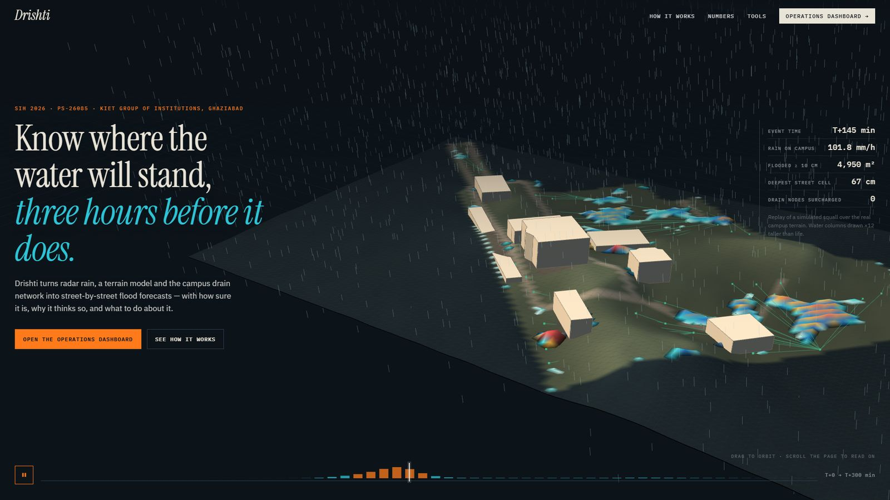

</div>

---

## Contents

1. [The problem](#1-the-problem)
2. [What Drishti does](#2-what-drishti-does)
3. [See it working](#3-see-it-working)
4. [How it works](#4-how-it-works)
5. [Results](#5-results)
6. [Quick start](#6-quick-start)
7. [Repository layout](#7-repository-layout)
8. [Data honesty](#8-data-honesty)
9. [Tech stack](#9-tech-stack)
10. [Roadmap](#10-roadmap)
11. [References](#11-references)

---

## 1. The problem

Indian cities flood in minutes, not days. A 60–100 mm cloudburst overwhelms drains that were sized for
about 40 mm/h, and water collects in the same low streets, underpasses and gates every monsoon. The
repo's own 10-year daily record for Ghaziabad shows a 57–115 mm day **every single year**.

Today's warnings are city-wide ("heavy rain expected"). An operator, an ambulance dispatcher or a
drainage engineer needs answers at street scale:

| Question | What the operator actually needs |
|---|---|
| **WHERE?** | Which streets, gates and buildings will flood |
| **WHEN?** | When a road crosses 10 cm, and when it peaks |
| **HOW BAD?** | Depth, duration, extent — with an honest range |
| **WHY?** | Rain intensity, terrain, a surcharged drain, a blockage? |
| **WHAT NOW?** | Which action or route change reduces the impact most |

## 2. What Drishti does

Drishti is a **closed-loop digital twin** of the campus streets and drains. Every 5 minutes it takes
rainfall observations, quality-checks them, forecasts 20 possible rain futures for the next 3 hours,
pushes them through coupled physics and a fast AI surrogate, and turns the result into maps,
early warnings, road status, routes and alerts — each labelled *observed / derived / modelled / synthetic*.

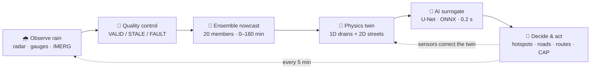

**What makes it different**

- **Physics + AI, not AI alone.** A mass-conserving 1D/2D model is the source of truth; a U-Net copy of
  it makes 20-member ensembles affordable; hotspots are re-run in full physics.
- **Probabilistic by default.** P10 / P50 / P90 depth, P(depth > 10 / 20 / 30 cm), time-to-threshold.
  No route is ever labelled absolutely "safe".
- **It diagnoses the drains.** Virtual sensors + a Kalman update cut sensor-level error from 19.9 cm to
  2.7 cm, isolate a stuck sensor, and rank the pipes most likely to be blocked.
- **It fails honestly.** Radar outage → gauge-only forecast, wider uncertainty and a DEGRADED banner.

## 3. See it working

The operator dashboard covers all five build tasks in eight views. Every number on it comes from real
model runs exported by `tools/export_dashboard.py`.

| | |
|---|---|
| 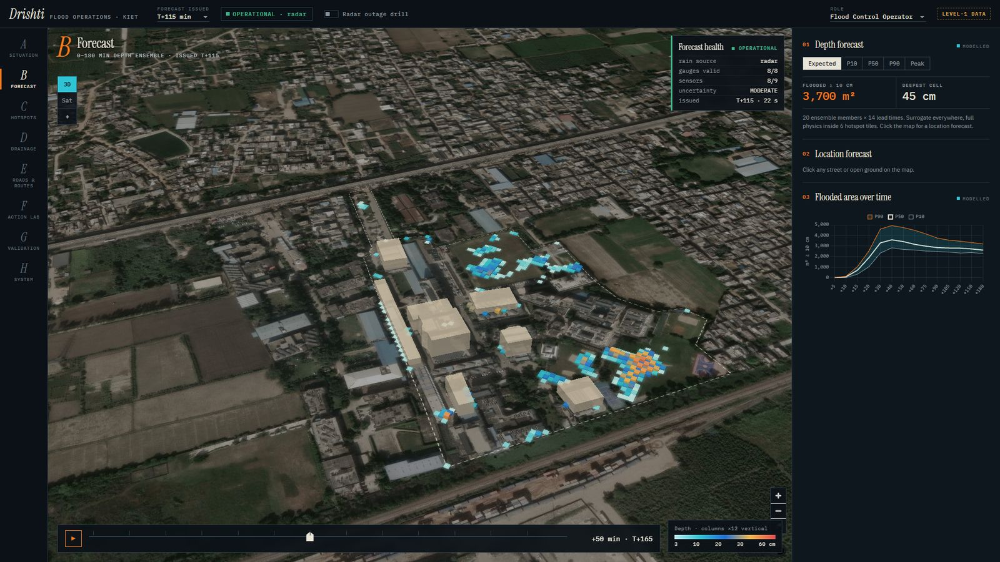 **B · Forecast** — expected / P10 / P50 / P90 depth at any lead, click a cell for its WHY? diagnosis | 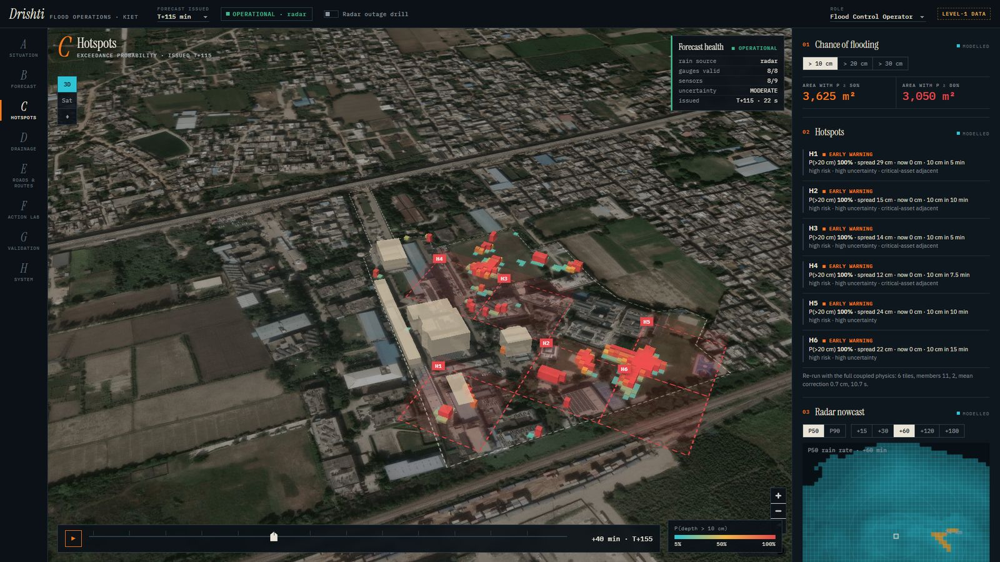 **C · Hotspots** — exceedance probability, hotspot tiles, early warnings, radar ensemble |
| 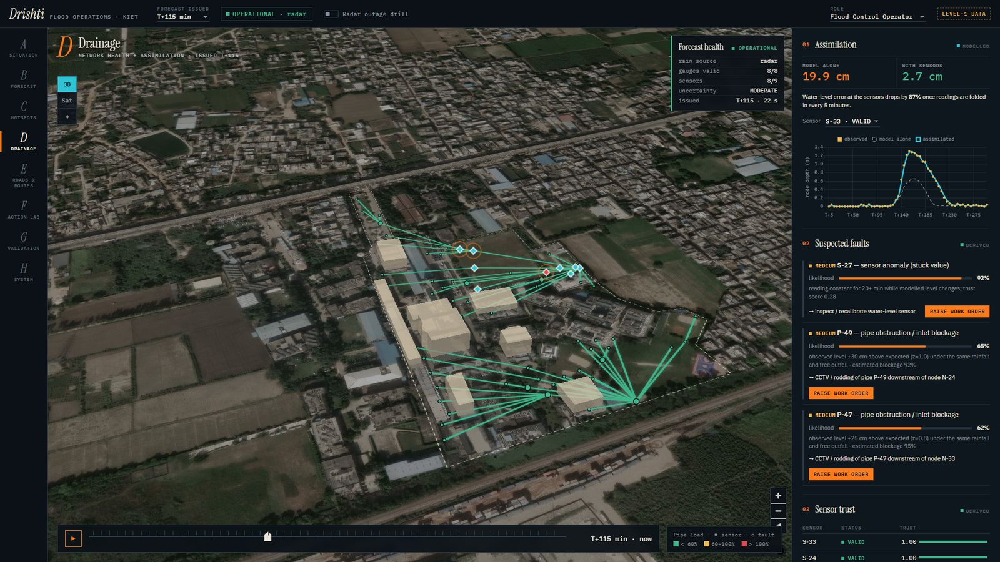 **D · Drainage health** — sensors with trust scores, open loop vs assimilated, suspected faults | 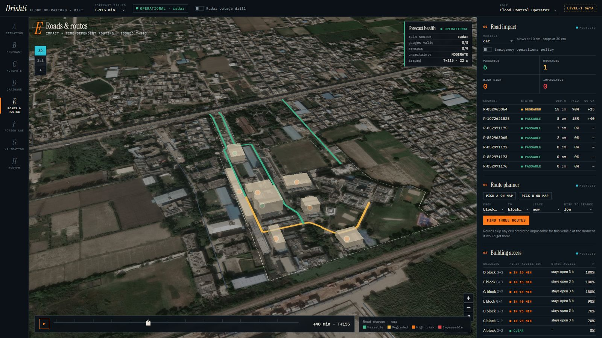 **E · Roads & routes** — road status per vehicle class, time-dependent 3-route planner |
| 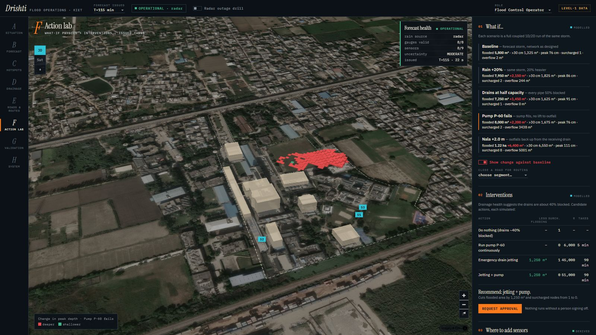 **F · Action lab** — physics what-ifs (pump failure shown) and ranked interventions | 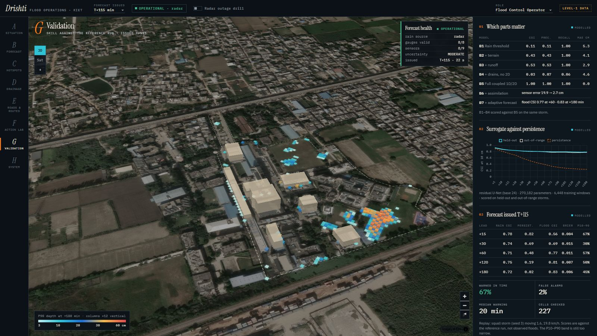 **G · Validation** — baselines B1–B7, surrogate vs persistence, forecast verification |
| 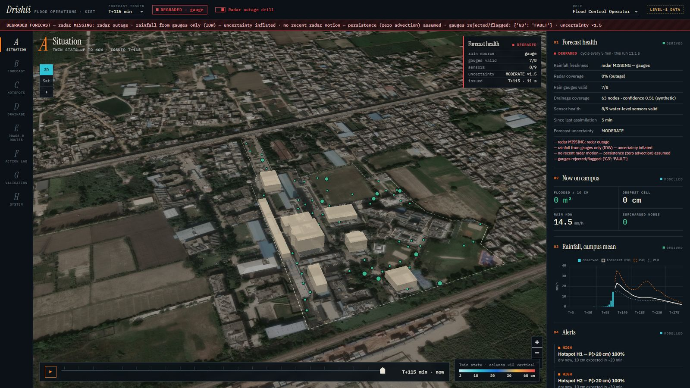 **Radar-outage drill** — the real degraded forecast with its DEGRADED banner | 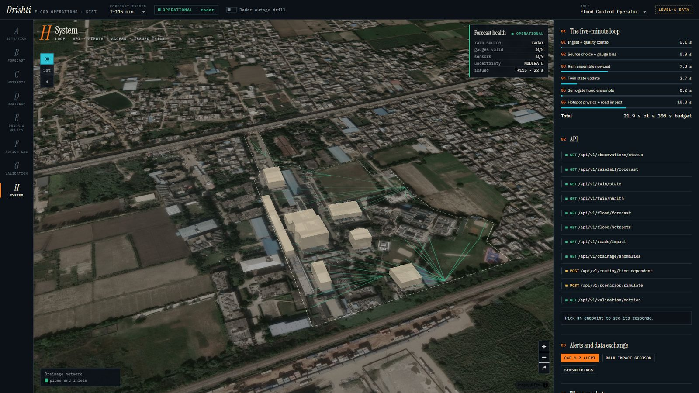 **H · System** — 5-minute loop timings, `/api/v1/*` explorer, CAP / GeoJSON export, RBAC |

<details>
<summary><b>Other apps in the repo</b></summary>

| Page | Purpose |
|---|---|
| `index.html` | Landing page — 3D storm replay over real terrain (Three.js) |
| `dashboard/` | Operator dashboard, views A–H, deep-linkable (`#forecast&lead=13`, `#actions&scen=pump_failure&diff=1`, `#live&drill=1`) |
| `flood_planner.html` | Tap-anywhere depth forecast (NOW → +180 min) + flood-aware routing |
| `flood_viewer.html` | Animated physics: rain → runoff → drains → surcharge → flooding, with an inspector |
| `kiet_3d_standalone.html` | Self-contained 3D terrain world |
| `kiet_road_map.html`, `kiet_terrain_map.html` | 2D road and terrain maps |

| Flood planner | Physics viewer |
|---|---|
| 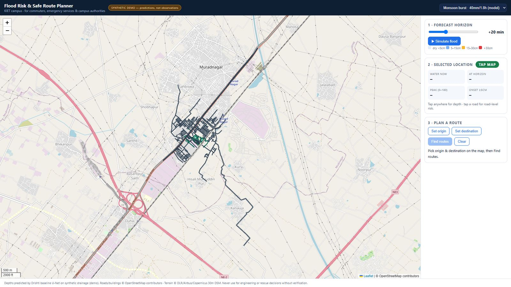 | 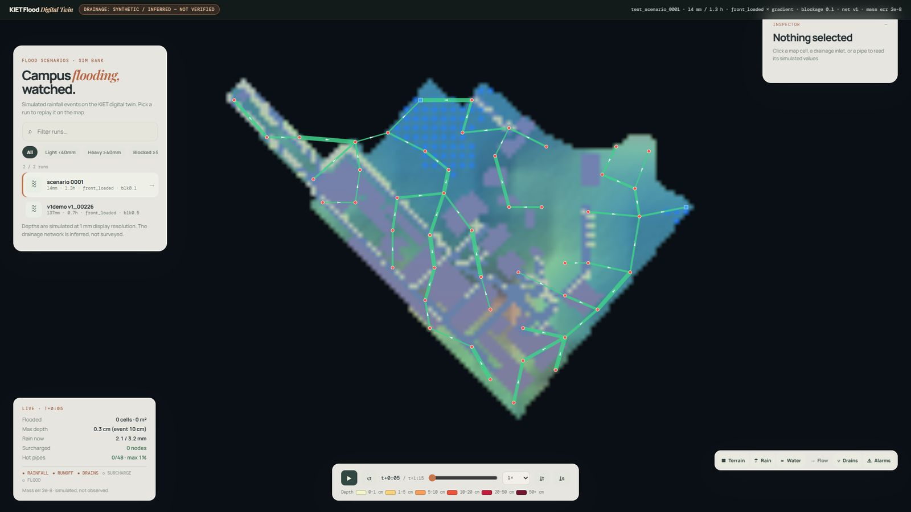 |

</details>

## 4. How it works

### 4.1 System architecture

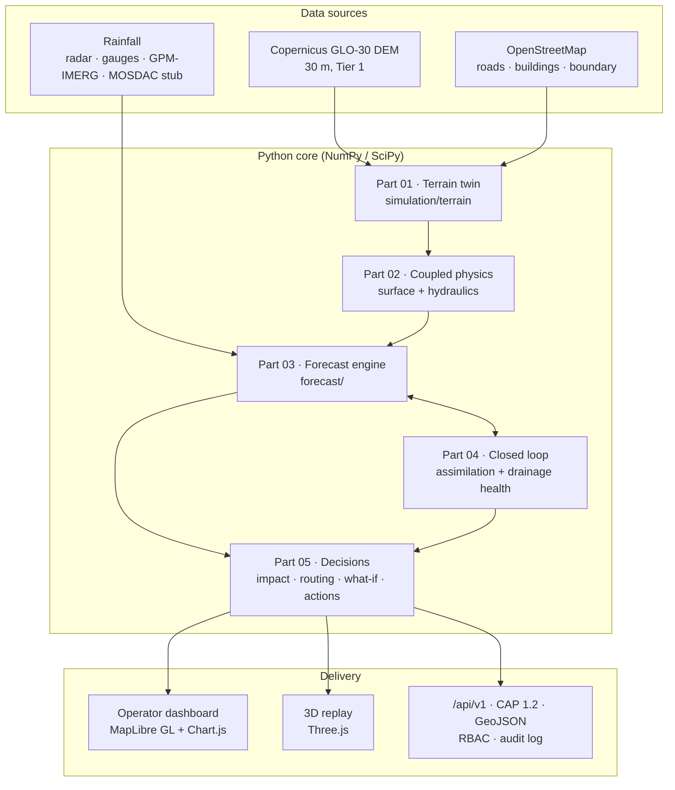

### 4.2 One forecast cycle (every 5 minutes)

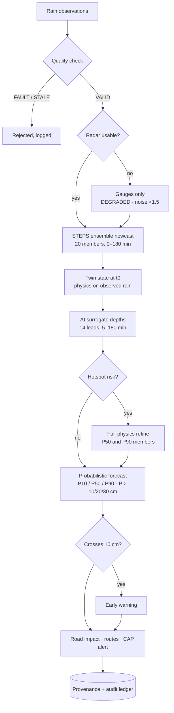

Measured on a laptop CPU (squall seed 3, 20 members): **18–20 s per cycle** against a 60 s budget —
ingest + QC 0.6 s, nowcast ≈ 8.5 s, twin state ≈ 2 s, surrogate 0.2 s, hotspot refinement ≈ 7.5 s.

### 4.3 Coupled 1D / 2D physics (Task 1)

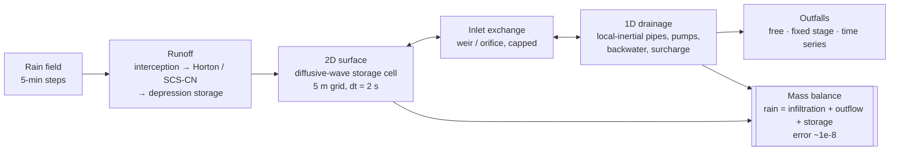

| SRS module | What | File |
|---|---|---|
| D | Terrain twin: 160 × 110 grid at 5 m, D8 flow, depressions, low points, data tier | `simulation/terrain/twin.py` |
| E | Runoff: interception, Horton or SCS-CN infiltration, depression storage | `simulation/surface/infiltration.py` |
| F | 2D surface: Manning face fluxes, 1/8-volume limiter, buildings as walls | `simulation/surface/runoff.py` |
| G | 1D drainage: local-inertial links, pumps with hysteresis, blockage | `simulation/hydraulics/network1d.py` |
| H | Surface ⇄ drain exchange: weir / orifice / submerged orifice | `simulation/hydraulics/exchange.py` |
| I | Boundaries: free, fixed stage, time series, tidal | `simulation/hydraulics/boundary.py` |

### 4.4 Rain nowcast + AI surrogate (Task 2)

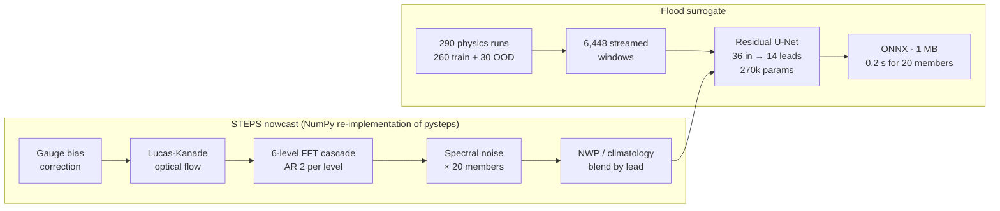

### 4.5 Closed loop: assimilation + drainage health (Task 3)

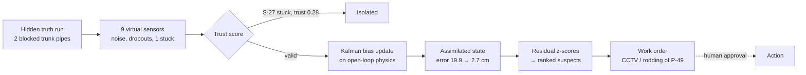

### 4.6 Decisions: impact, routing, what-if (Task 4)

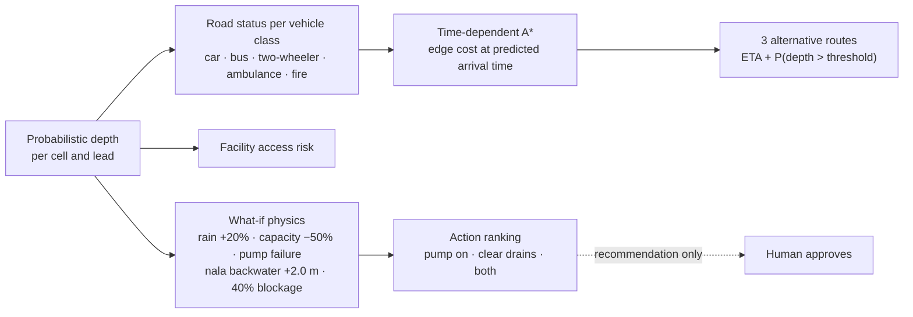

### 4.7 Data → model → apps pipeline

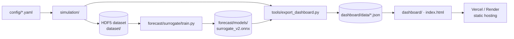

## 5. Results

> All figures below come from **synthetic twin experiments**: the system is scored against a hidden,
> physically simulated "truth" storm, not against observed floods (Level-1 demonstration, SRS §11).

**Surrogate vs persistence** — CSI at 10 cm depth, held-out physics storms (`forecast/models/surrogate_v2.json`)

| Lead | +5 min | +30 min | +60 min | +120 min | +180 min |
|---|---|---|---|---|---|
| Drishti U-Net | 0.93 | 0.82 | 0.80 | 0.79 | 0.79 |
| Persistence | 0.89 | 0.58 | 0.39 | 0.26 | 0.24 |
| Drishti, out-of-distribution (1.8–2.5× rain, 75% blockage) | 0.92 | 0.81 | 0.80 | 0.77 | 0.78 |
| RMSE, cm (persistence) | 0.66 (0.74) | 1.43 (2.57) | 1.96 (4.01) | 2.54 (5.36) | 2.38 (5.12) |

**End-to-end forecast verification** (`python -m forecast.verify`)

| Issue time | Rain CSI +60 / +180 (persistence) | Flood CSI 10 cm +60 / +180 | Early warning |
|---|---|---|---|
| T+90, before the squall | 0.75 / 0.73 (0.47 / 0.03) | 0.22 / 0.50 | 36 % of later-flooded cells flagged, 0 % false alarms, **50 min** ahead |
| T+115, storm established | 0.71 / 0.72 (0.48 / 0.02) | 0.77 / 0.83 | **67 %** flagged, **2 %** false alarms, 20 min ahead |
| T+115, radar outage + frozen gauge | 0.57 / 0.66 | 0.20 / 0.40 | 26 % flagged, 0 % false alarms — **DEGRADED**, gauge G3 = FAULT |

**Which components matter** — baselines on one 80 mm storm, scored against the full model B5

| Baseline | CSI | False-alarm ratio | Depth MAE |
|---|---|---|---|
| B1 rainfall threshold | 0.11 | 0.89 | 5.3 cm |
| B2 + terrain | 0.43 | 0.57 | 4.1 cm |
| B3 + runoff | 0.53 | 0.47 | 2.9 cm |
| B4 + drains, no 2D routing | 0.03 | 0.93 | 4.6 cm |
| **B5 full coupled 1D/2D** | **1.00** | **0.00** | **0** |
| B6 + assimilation | sensor-level error 19.9 → 2.7 cm | | |

**What-if physics** (each a full coupled simulation of the same storm)

| Scenario | Flooded area | Severe area | Peak depth | Drain overflow |
|---|---|---|---|---|
| Baseline | 5,800 m² | 1,325 m² | 0.76 m | 2 m³ |
| Rain +20 % | 7,950 m² | 1,825 m² | 0.86 m | 244 m³ |
| Drain capacity −50 % | 7,250 m² | 1,625 m² | 0.91 m | 0 m³ |
| Pump failure | 8,000 m² | 1,675 m² | 0.76 m | 3,438 m³ |
| Receiving nala at +2.0 m (backwater) | 12,200 m² | 6,550 m² | 1.11 m | 5,001 m³ |

**Physics checks:** mass balance closes to ~1e-8; blockage 0 → 50 % lowers drainage 12.2 → 8.2 mm and
raises ponding 44.5 → 48.5 mm; low points flood about 2× deeper; no NaN / negative depth across the suite.

**Known gaps (stated, not hidden):** the ensemble is under-dispersive (P10–P90 covers the truth in only
5–50 % of active cells), probabilities are not calibrated, there is no velocity forecast, and the
FastAPI server / database / auth layer is designed but not yet built — the dashboard's API explorer shows
the exact responses each endpoint will return.

## 6. Quick start

**Run the web apps** (static, no build step):

```bash
python -m http.server 8123
# http://localhost:8123/            3D replay (landing page)
# http://localhost:8123/dashboard/  operator dashboard
```

**Deploy to Vercel** (static, no build step — config in `vercel.json` + `.vercelignore`):

```bash
npm i -g vercel
vercel          # preview
vercel --prod   # production
```

Or import the GitHub repo at vercel.com → *Framework preset: Other*, leave build and output settings
empty (they come from `vercel.json`). Python code, docs and media are excluded from the upload, so
Vercel never tries to build `api/*.py` as serverless functions. Routes: `/`, `/dashboard/`,
`/planner`, `/viewer`.

**Run the models** (Python 3.12+):

```bash
pip install -r requirements.txt
python -m pytest tests -q                                            # 31 passed, 1 skipped

# Task 1 — coupled physics
python -m simulation.run --total-mm 80 --duration-h 1                # one storm
python -m simulation.run --total-mm 80 --boundary fixed_stage:2.0    # river backwater
python -m simulation.run --total-mm 80 --pump-failed                 # pump failure
python -m simulation.run --total-mm 80 --baselines                   # B1–B5 table
python -m simulation.drainage.swmm_export --variant 0                # export to EPA SWMM .inp

# Task 2 — probabilistic forecast
python -m forecast.run --event squall --seed 3 --t0 90                        # one cycle
python -m forecast.run --event squall --seed 3 --t0 90 --radar-outage 60:400  # DEGRADED mode
python -m forecast.run --event squall --t0 90 --gauge-fault G3:frozen:40      # faulty gauge
python -m forecast.verify --event squall --seed 3 --t0 90 --compare-refine    # score vs truth

# Rebuild the dashboard bundle from fresh model runs (~70 s)
python -m tools.export_dashboard
```

**Retrain the surrogate:**

```bash
python -m forecast.surrogate.dataset --n 260 --ood 30 --workers 6
python -m forecast.surrogate.train --epochs 12
```

## 7. Repository layout

```text
Drishti/
├── simulation/          Task 1 physics: terrain/, surface/, drainage/, hydraulics/, rainfall/, scenarios/, validation/
├── forecast/            Task 2: obs.py, quality.py, steps.py, motion.py, probabilistic.py, adaptive.py, surrogate/, run.py, verify.py
├── dataset/             Synthetic HDF5 dataset generator, normalisation, QC plots
├── models/              Baseline U-Net nowcaster + trainers
├── api/                 Flood-safe routing (route.py) and nowcast-driven routing (route_nowcast.py)
├── tools/               export_dashboard.py (model runs → dashboard/data) and checks
├── dashboard/           Operator dashboard (views A–H), data bundle in dashboard/data/
├── home/, index.html    Landing page with the 3D storm replay
├── config/              YAML: terrain, drainage, hydraulics, rainfall, simulation, forecast
├── data/                GeoJSON (roads, campus), terrain overlays, raw/rainfall CSVs
├── kiet_terrain/        Authoritative OSM campus boundary
├── planner/, outputs/viz-demo/       Pre-computed storms for the planner and viewer
├── space/               Hugging Face Space front-end
├── tests/               Pytest suite (physics, coupling, forecast, routing, U-Net)
├── docs/                SRS, TASKS, module docs, DEMO_SCRIPT, screenshots
├── ppt/                 SIH presentation (Drishti_SIH26085.pptx)
├── media/               4:51 explainer video
├── REPORT.md            Full project report
└── vercel.json          Static deployment config (+ .vercelignore)
```

Deeper docs: [SRS](docs/SRS.md) · [build plan](docs/TASKS.md) · [simulation](docs/simulation.md) ·
[forecast](docs/forecast.md) · [dashboard](docs/dashboard.md) · [validation](docs/validation.md) ·
[assumptions](docs/assumptions.md) · [project report](REPORT.md)

## 8. Data honesty

Drishti is a **Level-1 demonstration** (public rainfall, public DEM, synthetic drainage, simulated sensors).
It says so everywhere:

| Layer | Status | How it is labelled |
|---|---|---|
| Terrain | Copernicus GLO-30 DSM, 30 m, ±4 m, includes buildings | `data_tier = 1` shown in the UI; sub-30 m relief is interpolated |
| Roads, buildings, boundary | OpenStreetMap, not field-checked | source attribution |
| Drainage network | **Synthetic** — generated from terrain and roads | every node and pipe `verified=false`, confidence 0.3–0.7 |
| Radar, gauges, sensors | **Synthetic** twin experiment | "synthetic" badge, provenance in every JSON |
| Flood depths | Model output, never observation | "modelled" badge |

Replacing the synthetic network with a surveyed one needs **no code change** — drop in a JSON with the
same schema and set `verified=true` ([docs/drainage.md](docs/drainage.md)).

## 9. Tech stack

| Layer | Tools |
|---|---|
| Physics & forecasting | Python, NumPy, SciPy, PyYAML, h5py |
| Machine learning | PyTorch (training), ONNX / ONNX Runtime (inference) |
| Web | MapLibre GL (3D map), Three.js (3D replay), Chart.js, Leaflet — no build step |
| Hosting | Vercel / Render static hosting, Hugging Face static Space |
| Quality | pytest (31 tests), in-run validation gates, mass-balance checks |
| Standards | OASIS CAP 1.2 alerts, GeoJSON, SensorThings-style observations, EPA SWMM `.inp` export |

## 10. Roadmap

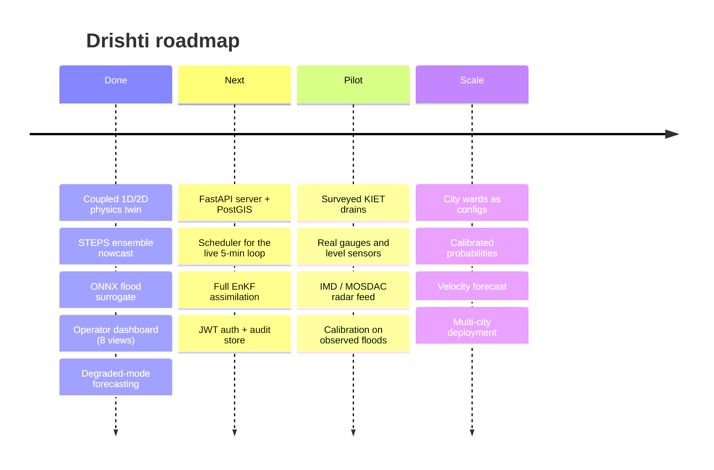

## 11. References

- Bates, P. D. & De Roo, A. P. J. (2000). A simple raster-based model for flood inundation simulation. *Journal of Hydrology* 236, 54–77.
- Rossman, L. A. (2017). *Storm Water Management Model Reference Manual, Vol. II — Hydraulics*. US EPA 600/R-17/111.
- Bowler, N. E., Pierce, C. E. & Seed, A. W. (2006). STEPS: a probabilistic precipitation forecasting scheme. *QJRMS* 132, 2127–2155.
- Pulkkinen, S. et al. (2019). Pysteps: an open-source Python library for probabilistic precipitation nowcasting. *Geosci. Model Dev.* 12, 4185–4219.
- Ronneberger, O., Fischer, P. & Brox, T. (2015). U-Net: convolutional networks for biomedical image segmentation. *MICCAI*.
- Evensen, G. (1994). Sequential data assimilation with a nonlinear quasi-geostrophic model using Monte Carlo methods. *JGR* 99(C5).
- National Disaster Management Authority (2010). *Management of Urban Flooding* — National Disaster Management Guidelines.

---

<div align="center">

Sources: © OpenStreetMap contributors · Terrain © DLR / Airbus / Copernicus · Imagery © Esri<br>
Built for Smart India Hackathon 2026 by Team LLMao

</div>
