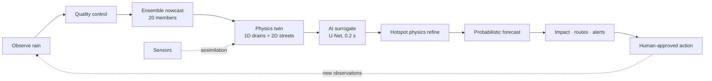
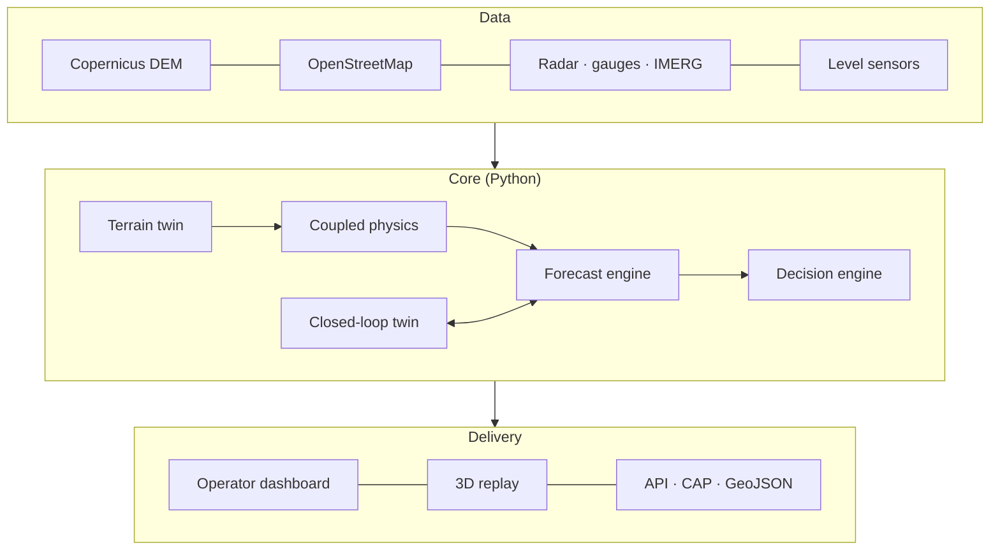

# Drishti — Project Report

**Street-Level Urban Flood Nowcasting with a Closed-Loop Digital Twin**
Smart India Hackathon 2026 · Problem Statement SIH26085 · Theme: Disaster Management · Category: Software
Team LLMao · Pilot site: KIET Group of Institutions, Ghaziabad (28.7523° N, 77.4985° E)

---

## 1. Problem statement

Urban flooding in India is a flash phenomenon. A convective storm of 60–100 mm can overwhelm drains
designed for roughly 40 mm/h within half an hour, and water collects in the same low streets, gates and
underpasses every monsoon. Existing warnings are issued at city or district scale ("heavy rain
expected"), which does not tell anyone what to do.

The problem asks for a system that predicts **street-level flooding 0–3 hours ahead** by combining
rainfall, terrain and the drainage network, and that turns the prediction into operational decisions
such as flood-safe routing.

Operators need five answers, at street scale:

| Question | Need |
|---|---|
| **Where?** | Which streets, junctions and buildings will flood |
| **When?** | When each road crosses a dangerous depth, and when it peaks |
| **How severe?** | Depth, duration and extent — with an honest uncertainty range |
| **Why?** | Rainfall, terrain, drain surcharge, blockage or downstream backwater |
| **What to do?** | Which intervention or route change reduces the impact most |

## 2. Why this is hard

- **Three coupled systems.** Street water depends on rain, on how the ground routes runoff, and on how
  the drains capture and return it. Rainfall alone is a poor predictor: in our experiments a
  rainfall-threshold baseline scores a CSI of 0.11 with an 89% false-alarm ratio.
- **Speed vs fidelity.** Physics models are accurate but slow; a probabilistic forecast needs many runs
  every few minutes.
- **Uncertainty.** Rain cells move and grow; a single deterministic forecast gives false confidence.
- **Imperfect data.** Radar feeds drop out, gauges freeze, drains silt up, and many cities have no
  digital drain map at all.
- **Trust.** A system that raises false alarms or fails silently stops being used.

## 3. Objectives

1. Forecast flood depth on a 5 m street grid for 5–180 minutes ahead, refreshed every 5 minutes.
2. Express every forecast as a probability (P10 / P50 / P90, exceedance of 10 / 20 / 30 cm).
3. Couple rainfall, terrain, 2D surface flow and 1D drainage hydraulics in a mass-conserving model.
4. Correct the model with live sensor data and diagnose drainage faults.
5. Convert forecasts into road status, time-dependent routes, what-if analysis and ranked actions.
6. Keep working — and say so — when input data degrades.
7. Deliver it all in an operator dashboard that runs in any browser.

## 4. Our idea

**Drishti** ("vision") is a closed-loop digital twin of a campus's streets and drains. Instead of a
dashboard that only displays data, it keeps a running physical model of the area, corrects it with every
new observation, and uses it to look three hours ahead.



Three ideas set it apart:

- **Physics + AI.** A coupled hydraulic model is the source of truth. A neural network trained on that
  model reproduces it in 0.2 s, which makes a 20-member ensemble affordable. Where risk or uncertainty
  is high, the full physics re-checks the AI.
- **The twin diagnoses the drains.** Comparing what the drains should do with what sensors see reveals
  blockages and faulty sensors, each reported with evidence and a recommended inspection.
- **Honesty by design.** Every output is labelled *observed / derived / modelled / synthetic*; losing the
  radar switches the platform to a clearly flagged DEGRADED mode; no route is ever called "safe".

## 5. Approach

The work was organised as five tasks, each ending in a working, demonstrable system.

| # | Task | What it delivers |
|---|---|---|
| 1 | Physics core | Terrain twin, synthetic drain network, coupled 1D/2D hydraulics, boundary conditions, baselines |
| 2 | Forecast | Rainfall adapters, quality engine, STEPS ensemble nowcast, ONNX flood surrogate, probabilistic forecast, hotspot refinement, degraded modes |
| 3 | Closed loop | Virtual sensor network, Kalman state correction, sensor fault isolation, drainage-health diagnosis, forecast health card |
| 4 | Decisions | Road impact per vehicle class, time-dependent routing, facility access, what-if simulation, action ranking, sensor placement |
| 5 | Platform | Operator dashboard (8 views), API layer, CAP 1.2 / GeoJSON export, role-based access, audit log, validation and replay |

### 5.1 System architecture



## 6. Methodology in detail

### 6.1 Terrain twin
Copernicus GLO-30 elevation is resampled to a 160 × 110 grid at 5 m around the campus. The twin derives
slope, a priority-flood filled surface, depression depth, D8 flow direction and accumulation, and low
points. OpenStreetMap roads, buildings and the campus boundary become land-cover masks and Manning
roughness. Metadata records the CRS, vertical datum and data tier, and the tier is shown in the UI.

### 6.2 Drainage network
Inlets are placed where flow accumulation, low points and road proximity score highest; pipes follow a
shortest-path tree to the lowest outfalls and are sized with the Rational method. A pump station sits in
front of the main outfall. The resulting graph (63 nodes, 61 links) exports to EPA SWMM `.inp` format
for cross-checking. Each asset carries a confidence value and a `verified` flag, so surveyed data can
replace it through the same schema.

### 6.3 Coupled hydraulics
Each 5-minute rain step runs as 150 sub-steps of 2 s:

1. **Runoff** — interception, then Horton or SCS-CN infiltration, then depression storage.
2. **2D surface** — diffusive-wave storage cells; Manning flux `q = h^(5/3)/n · √S · dx` with a
   stability limiter; buildings act as walls.
3. **Exchange** — at each inlet, the lesser of weir and orifice capture, a submerged orifice when the
   pipe is pressurised, and surcharge back to the street when the node overflows.
4. **1D drainage** — local-inertial momentum in each pipe and continuity at each node, giving
   backwater, reverse flow and pressurised flow; pumps with on/off hysteresis; blockage reduces capacity.
5. **Boundaries** — free, fixed-stage, time-series or tidal outfalls.

Every run reports a full mass balance; the relative error is about 1e-8.

### 6.4 Rainfall observation and quality control
Pluggable adapters read radar, gauges, archived radar or GPM-IMERG stacks, gauge CSVs, the MOSDAC
pathway and NWP guidance. A quality engine tags every observation VALID, SUSPECT, STALE, MISSING or
FAULT using range, spike, frozen-value, clock-drift, staleness, coverage and gauge-vs-radar checks. Only
valid data drives the forecast.

### 6.5 Ensemble rain nowcast (STEPS)
Gauge-bias-corrected radar is advected with pyramidal Lucas–Kanade optical flow, decomposed into a
6-level FFT cascade with an AR(2) model per level, perturbed with spectral noise to create 20 members,
probability-matched, and blended with NWP or climatology as lead time grows (nowcast weight 1.0 up to
30 min, 0.2 at 180 min).

### 6.6 AI flood surrogate
A residual U-Net (270,182 parameters) takes 36 input channels — terrain, land cover, six steps of rain
and depth history, cumulative future rain per lead, and a blockage plane — and predicts depth at 14
leads from 5 to 180 minutes. It was trained on 290 six-hour physics simulations (260 in-distribution,
30 out-of-distribution with 1.8–2.5× rain and 75% blockage), split by storm, and exported to a 1 MB ONNX
model that processes all 20 members in 0.2 s on a CPU.

### 6.7 Probabilistic forecast and hotspot refinement
For every cell and road segment the ensemble yields expected depth, P10/P50/P90, peak depth and time,
time-to-10 cm, duration and exceedance probabilities. The domain is tiled into 80 m blocks; tiles with
high risk, wide spread or buildings nearby are re-simulated with full physics for the P50 and P90
members, and the correction is spread to the other members. Cells still dry but likely to cross 10 cm
become **early warnings**.

### 6.8 Degraded modes
With usable radar the forecast is OPERATIONAL. If radar is lost and at least three gauges are valid, the
system interpolates gauges, inflates noise ×1.5, reduces the nowcast weight and flags DEGRADED; with
fewer gauges it falls back to NWP or climatology. Every cause is listed in the forecast health card.

### 6.9 Closed loop: assimilation and drainage health
Nine water-level sensors in the drains feed a per-sensor Kalman update of the physics state. Innovation
checks give each sensor a trust score, so a stuck sensor is isolated automatically. Residuals between
expected and observed levels under the same rain rank the assets most likely to be blocked, each with a
likelihood, the evidence and a recommended inspection (for example, CCTV and rodding of a pipe).

### 6.10 Decisions
- **Road impact:** every road segment is classed passable, degraded, high-risk or impassable with
  thresholds per vehicle (two-wheeler 7/15 cm up to fire truck 35/60 cm) and an emergency policy.
- **Routing:** time-dependent A* costs each edge at the depth forecast for the predicted arrival time
  and returns three alternatives with ETA and flood probability.
- **Facilities:** time until each building's access is at risk.
- **What-if:** full physics runs for heavier rain, halved drain capacity, pump failure and nala
  backwater.
- **Actions:** pump operation, drain jetting and their combination ranked by effect and cost; each
  needs human approval.
- **Sensor placement:** greedy selection of the location that most reduces forecast spread.

### 6.11 Platform
The operator dashboard has eight views — Situation, Forecast, Hotspots, Drainage, Roads & routes,
Action lab, Validation and System — on a 3D satellite map with extruded buildings. It includes a
forecast issue-time selector for replaying past cycles, a radar-outage drill, a "Why here?" factor
breakdown for any street cell, and a role selector enforcing access for six roles (administrator,
operator, dispatcher, model engineer, infrastructure engineer, public). The System view exposes the
`/api/v1` interface with live responses, CAP 1.2 alert export, GeoJSON and SensorThings-style data, the
role matrix and the audit log. Every forecast carries a provenance record (inputs, model, configuration,
timings) so any run can be replayed.

## 7. Data

| Data | Source | Use |
|---|---|---|
| Terrain | Copernicus GLO-30 DSM (30 m) | Terrain twin |
| Roads, buildings, boundary | OpenStreetMap | Land cover, routing graph |
| Rainfall climatology | 10-year daily record for Ghaziabad (2016–2026) | Storm ranges, climatology fallback |
| Radar / gauges / sensors | Twin-experiment generators with realistic bias, noise and faults | Forecast and assimilation |
| Drainage network | Generated from terrain and roads | Hydraulics |

The rainfall record shows the risk is real: the wettest day each year from 2017 to 2025 ranged from
57 mm to 115 mm.

## 8. Implementation

| Layer | Technology |
|---|---|
| Physics, forecasting, assimilation | Python, NumPy, SciPy, PyYAML, h5py |
| Machine learning | PyTorch for training, ONNX Runtime for inference |
| Web | MapLibre GL, Three.js, Chart.js, Leaflet — static, no build step |
| Quality | pytest suite (31 tests), in-run validation gates, mass-balance checks |
| Deployment | Vercel static hosting (`vercel.json`, `.vercelignore`) |
| Standards | OASIS CAP 1.2, GeoJSON, SensorThings-style schema, EPA SWMM `.inp` |

Configuration lives in six YAML files (terrain, drainage, hydraulics, rainfall, simulation, forecast).
`tools/export_dashboard.py` runs the models end to end and writes the data bundle that the dashboard and
homepage read.

## 9. Results

All results are from twin experiments: the system forecasts a storm whose "truth" is simulated with the
full physics and hidden from it.

**Forecast cycle time:** 18–20 s on a laptop CPU against a 60 s budget.

**Surrogate skill (CSI at 10 cm, held-out storms)**

| Lead | +5 | +30 | +60 | +120 | +180 min |
|---|---|---|---|---|---|
| Drishti | 0.93 | 0.82 | 0.80 | 0.79 | 0.79 |
| Persistence | 0.89 | 0.58 | 0.39 | 0.26 | 0.24 |
| Drishti, out-of-distribution | 0.92 | 0.81 | 0.80 | 0.77 | 0.78 |

**End-to-end forecast**

| Issue time | Flood CSI +60 / +180 | Early warning |
|---|---|---|
| Before the squall | 0.22 / 0.50 | 36% of later-flooded cells flagged, 0% false alarms, 50 min ahead |
| Storm established | 0.77 / 0.83 | 67% flagged, 2% false alarms, 20 min ahead |
| Radar outage + frozen gauge | 0.20 / 0.40 | 26% flagged, 0% false alarms, correctly flagged DEGRADED |

**Why coupling matters (CSI against the full model):** rainfall threshold 0.11 → + terrain 0.43 → +
runoff 0.53 → full coupled 1D/2D 1.00.

**Closed loop:** sensor-level error falls from 19.9 cm (open loop) to 2.7 cm after assimilation; the stuck
sensor drops to trust 0.28 and is isolated; a hidden pipe blockage is identified among the top suspects.

**What-if (same storm):** baseline 5,800 m² flooded; rain +20% → 7,950 m²; pump failure → 8,000 m² with
3,438 m³ drain overflow; nala backwater +2 m → 12,200 m².

**Physics checks:** mass error ~1e-8; more blockage reduces drainage (12.2 → 8.2 mm) and increases
ponding (44.5 → 48.5 mm); low points flood about twice as deep; no negative or non-finite depths.

## 10. Deployment

The web application is fully static and deploys to Vercel with the included configuration:

```bash
vercel --prod
```

`vercel.json` sets a no-build static deployment with trailing-slash routing (so the dashboard's relative
data paths resolve), JSON / GeoJSON content types and caching, and short routes (`/planner`,
`/viewer`). `.vercelignore` keeps the Python code, documents and media out of the upload. The upload is
about 20 MB. Locally, `python -m http.server 8123` serves the same site.

## 11. Impact

- **Public safety:** street-by-street warnings before water reaches ankle depth.
- **Emergency response:** routes checked against the water expected when the vehicle arrives.
- **Infrastructure:** blocked drains and faulty sensors found with evidence, so crews fix the right
  asset first.
- **Governance:** every forecast is replayable and every action is approved and logged.
- **Planning:** what-if runs show which investment reduces flooding most.
- **Cost:** open data, open software and a CPU-only forecast loop — no GPU or per-forecast cloud bill.
- **Policy fit:** supports local early warning under the NDMA urban flooding guidelines, SDG 11.5 and
  the Sendai Framework.
okay
## 12. Future scope

- Onboard surveyed drain networks, real gauges and level sensors, and the IMD/MOSDAC radar feed.
- Calibrate probabilities across many observed events and add a velocity forecast.
- Extend from the campus to city wards, each configured as a new twin.

## 13. Conclusion

Drishti shows that street-level flood nowcasting is practical on commodity hardware when physics and
machine learning are combined carefully: physics for correctness, a learned surrogate for speed, an
ensemble for honest uncertainty, and sensors for continuous correction. The result answers where, when,
how badly, why and what to do — every five minutes, in a browser.

## References

1. Bates & De Roo (2000). A simple raster-based model for flood inundation simulation. *J. Hydrology* 236.
2. Rossman (2017). *SWMM Reference Manual, Vol. II — Hydraulics*. US EPA.
3. Bowler, Pierce & Seed (2006). STEPS: a probabilistic precipitation forecasting scheme. *QJRMS* 132.
4. Pulkkinen et al. (2019). Pysteps: an open-source library for probabilistic precipitation nowcasting. *GMD* 12.
5. Ronneberger, Fischer & Brox (2015). U-Net. *MICCAI*.
6. Evensen (1994). Sequential data assimilation using Monte Carlo methods. *JGR* 99(C5).
7. NDMA (2010). *National Disaster Management Guidelines: Management of Urban Flooding*.
