# Drishti — Demo Script & Explainer

**SIH 2026 · PS SIH26085 · Team LLMao**
*Use this document to present, demo and defend Drishti. Every number in it comes from the model runs in
this repository. Lines in "Say" blocks are meant to be spoken; everything else is for you.*

---

## How to use this document

| If you have… | Use |
|---|---|
| 2 minutes | [§1 The 60-second pitch](#1-the-60-second-pitch) + the loop diagram |
| 7 minutes (slides) | [§5 Slide-by-slide talk track](#5-slide-by-slide-talk-track) |
| 10 minutes (live) | [§4 Live demo walkthrough](#4-live-demo-walkthrough) |
| Judges' questions | [§7 Q&A bank](#7-qa-bank) |
| A technical reviewer | [§6 Technical deep dive](#6-technical-deep-dive) |

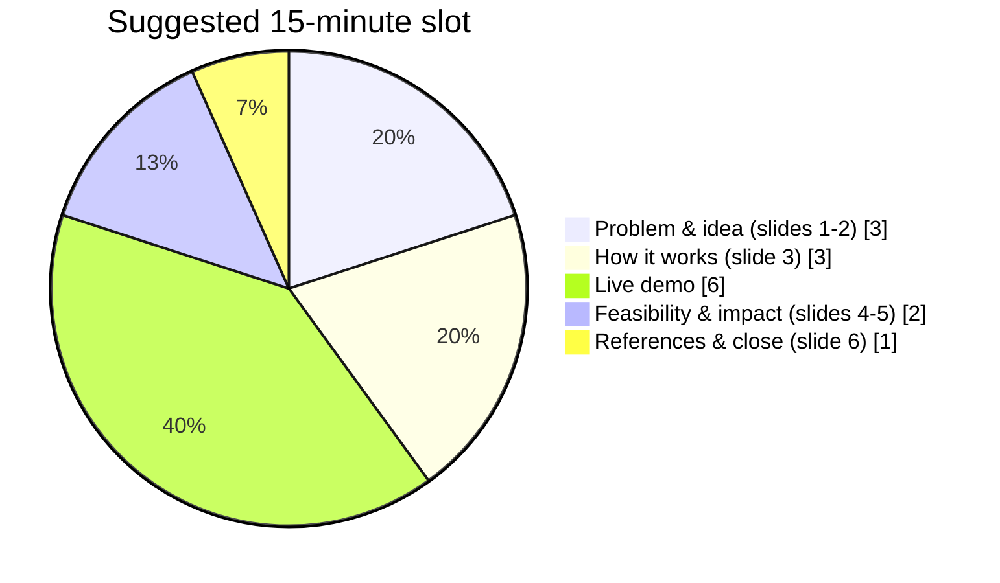

---

## Contents

1. [The 60-second pitch](#1-the-60-second-pitch)
2. [The problem, explained](#2-the-problem-explained)
3. [The solution, explained](#3-the-solution-explained)
4. [Live demo walkthrough](#4-live-demo-walkthrough)
5. [Slide-by-slide talk track](#5-slide-by-slide-talk-track)
6. [Technical deep dive](#6-technical-deep-dive)
7. [Q&A bank](#7-qa-bank)
8. [Pre-demo checklist & fallbacks](#8-pre-demo-checklist--fallbacks)
9. [Glossary](#9-glossary)

---

## 1. The 60-second pitch

> **Say:** "Every monsoon, Indian cities flood in minutes. The warnings people get are city-wide —
> *heavy rain expected*. But a traffic officer, an ambulance dispatcher or a drainage engineer needs to
> know **which street**, **when**, **how deep**, **why**, and **what to do**.
>
> Drishti is a digital twin of a campus's streets and drains. Every five minutes it takes the rain it can
> see, forecasts twenty possible rain futures for the next three hours, runs them through a physics model
> of how water flows over the ground and through the pipes, and turns that into street-level flood
> forecasts — with a confidence band, a reason, and a recommended action.
>
> It runs a full cycle in about 19 seconds on a laptop CPU. In replayed storms it warned 67% of the
> cells that later flooded, with 2% false alarms. And when the radar fails, it doesn't guess silently —
> it falls back to gauges and says DEGRADED on screen."

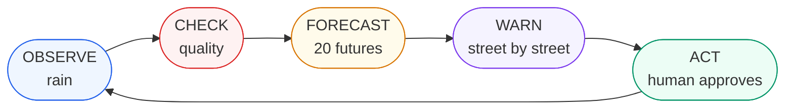

---

## 2. The problem, explained

### 2.1 Why urban floods are hard to predict

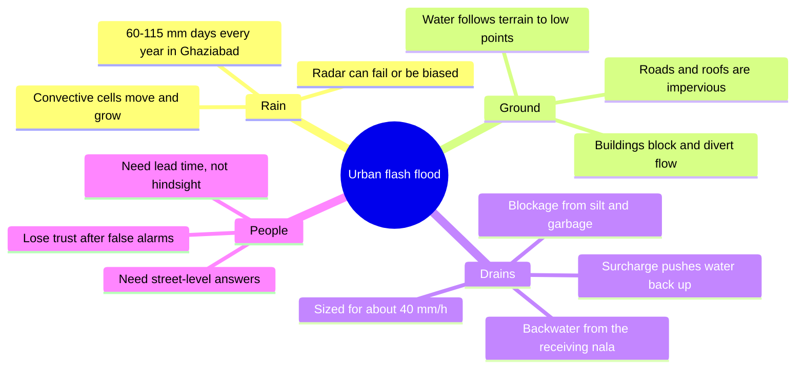

> **Say:** "Flooding on a street is the result of three systems interacting: the rain, the ground, and the
> drains. You can't predict it from rainfall alone — our own baseline that uses only a rainfall
> threshold gets a CSI of 0.11 and nine false alarms out of ten. You need all three, coupled."

### 2.2 Who needs the answer

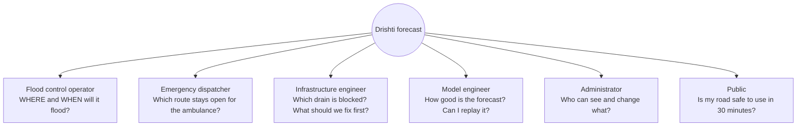

These six roles are real in the dashboard: the **role selector** in the header locks views per role
(for example, a public viewer only sees Situation, Forecast and Roads).

### 2.3 The five questions

| # | Question | Drishti's answer | Where it is shown |
|---|---|---|---|
| Q1 | **WHERE?** | Flood depth on a 5 m grid, per road segment | Forecast view (B), map |
| Q2 | **WHEN?** | Time to 10 cm, peak time, duration | Click any cell in view B |
| Q3 | **HOW BAD?** | Expected / P10 / P50 / P90 depth, P(depth > 10/20/30 cm) | Views B and C |
| Q4 | **WHY?** | Rainfall / runoff / terrain / drainage / asset / boundary factors | "Why here?" panel in view B |
| Q5 | **WHAT NOW?** | Ranked interventions, 3 alternative routes, work orders | Views E and F |

---

## 3. The solution, explained

### 3.1 The closed loop

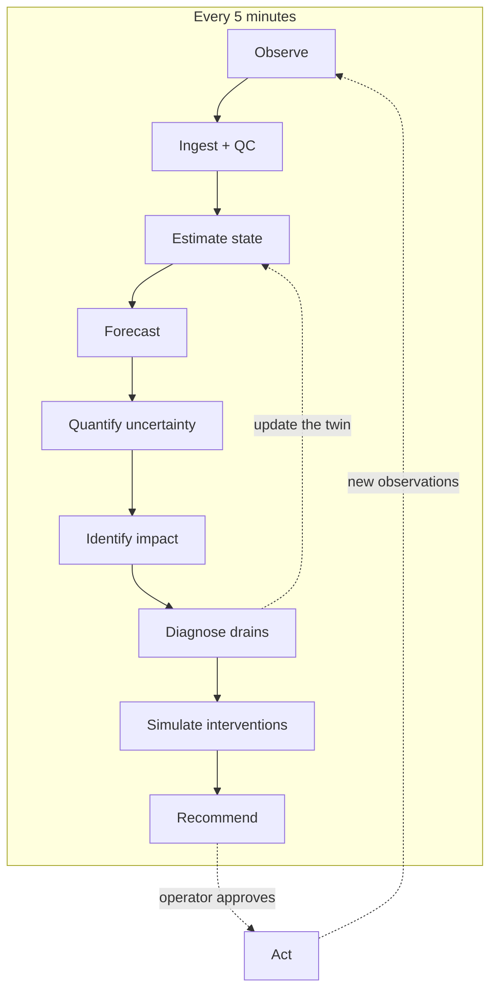

> **Say:** "This is the difference between a dashboard and a digital twin. A dashboard shows you data.
> A twin keeps a running model of the physical system, corrects it with every new observation, and uses
> it to look ahead."

### 3.2 System architecture

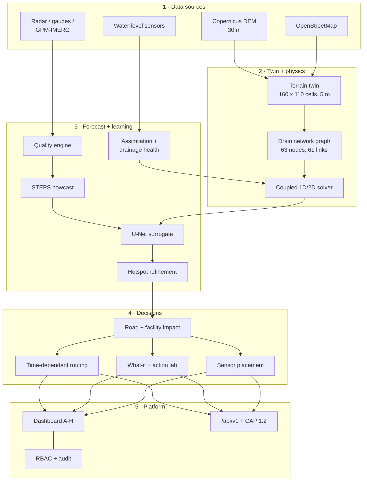

### 3.3 The tech inside each box

| Box | Method | Code |
|---|---|---|
| Terrain twin | Copernicus GLO-30 → bilinear to 5 m, priority-flood fill, D8 flow, low points; OSM roads and buildings rasterised | `simulation/terrain/twin.py` |
| Drain network | Inlets placed by flow accumulation + low points + road proximity; Dijkstra tree to outfalls; Rational-method sizing | `simulation/drainage/network.py` |
| Coupled physics | 2D diffusive-wave storage cells + 1D local-inertial pipes + weir/orifice exchange | `simulation/hydraulics/simulate.py` |
| Quality engine | Range, spike, frozen, drift, stale, coverage, gauge-vs-radar checks | `forecast/quality.py` |
| STEPS nowcast | Optical flow + 6-level FFT cascade with AR(2) + spectral noise + NWP blend | `forecast/steps.py`, `forecast/motion.py` |
| Surrogate | Residual U-Net, 36 input channels → depth at 14 leads, exported to ONNX | `forecast/surrogate/` |
| Hotspots | 80 m tiles; full physics for the P50 and P90 members where risk or spread is high | `forecast/adaptive.py` |
| Probabilistic forecast | Per cell and per road: P10/P50/P90, peak, time-to-10 cm, duration, exceedance | `forecast/probabilistic.py` |
| Assimilation + health | Per-sensor Kalman bias update, innovation-based fault isolation, residual z-scores | `tools/export_dashboard.py` |
| Routing | Time-dependent A* — each edge is costed at the predicted arrival time | `dashboard/app.js`, `api/route.py` |

### 3.4 What makes it different

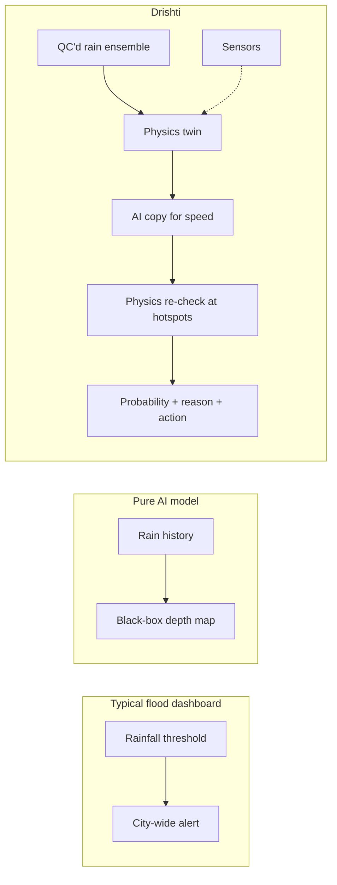

---

## 4. Live demo walkthrough

### 4.0 Setup (do this before you walk in)

```bash
cd Drishti
python -m http.server 8123
# open two tabs:
#   http://localhost:8123/                         (landing page, 3D replay)
#   http://localhost:8123/dashboard/               (operator dashboard)
```

Backup: the same pages are hosted at `https://drishti-sand.vercel.app/` and
`https://drishti-sand.vercel.app/dashboard/`. The 4:51 explainer video is `brag-output/brag.mp4`.

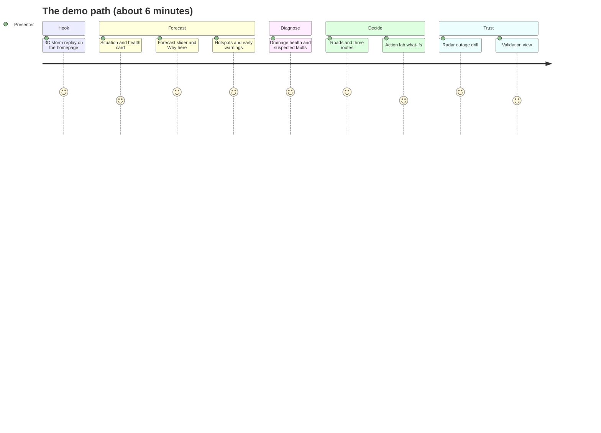

### Step 1 — The hook: the 3D replay (30 s)


**Do:** open the landing page and let the storm play. Drag to orbit.

> **Say:** "This is the real KIET campus terrain, the real buildings from OpenStreetMap, and our drain
> network in green. The rain falling is a simulated squall moving across campus. Watch the water collect
> — it doesn't spread evenly, it runs to the low points and backs up where the drains can't take it.
> The water columns are drawn twelve times taller than life so you can see them. The panel on the right
> is live: rain rate, flooded area, the deepest street cell."

**Do:** click **Open the operations dashboard**.

### Step 2 — Situation (view A) (45 s)

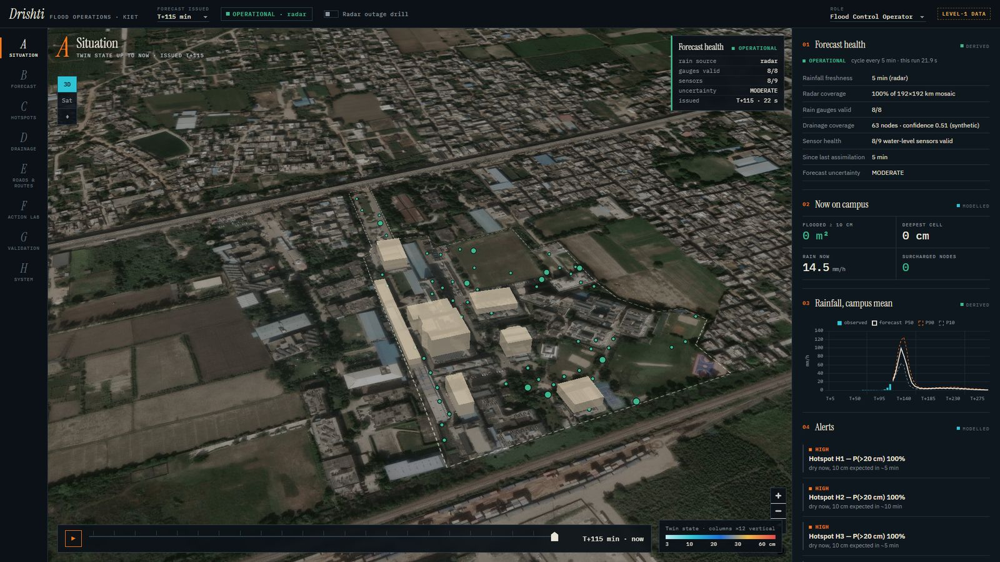

**Point at:** the **Forecast health** card (top right of the map, always visible), the header's
**Forecast issued** selector and the green **OPERATIONAL · radar** pill.

> **Say:** "This is what an operator sees first. Top right is the forecast health card — rain source,
> how many gauges are valid, how many sensors we trust, the uncertainty level and when the forecast was
> issued. It never leaves the screen, because a forecast is only as good as the data behind it.
> The header lets me replay three forecast cycles of the same storm: before it arrived, once it was
> established, and later."

### Step 3 — Forecast (view B) and "Why here?" (90 s)


**Do:** press **B**. Drag the lead-time slider from +5 to +180 min. Switch **Expected / P10 / P50 / P90 /
Peak**. Then click a coloured cell near a building.

> **Say:** "Now I'm looking ahead. This slider runs from five minutes to three hours. Blue is shallow,
> orange is deep. These buttons switch between the expected depth and the pessimistic P90 — the depth we
> are 90% sure won't be exceeded. When I click a street cell I get its own forecast: depth now, depth at
> my chosen lead, expected peak and when, and **when it reaches 10 centimetres**. The grey lines are the
> twenty ensemble members — that spread is our uncertainty, shown, not hidden.
>
> And underneath: **Why here?** Drishti breaks the risk into rainfall, runoff, terrain, drainage, known
> faults and the downstream boundary, and names the main driver. That answers the question every
> engineer asks: *why is this street flooding?*"

### Step 4 — Hotspots (view C) (45 s)


**Do:** press **C**. Toggle **> 10 / > 20 / > 30 cm**. Point at the hotspot list and the radar mini-map.

> **Say:** "This is the probability view — the chance each cell goes above 10, 20 or 30 centimetres. The
> outlined tiles are hotspots: places with high risk, high uncertainty, or next to a building. For those,
> Drishti re-runs the full physics model instead of trusting the AI copy. Some are marked **early
> warning**: still dry now, but more likely than not to cross 10 cm. At the forecast issued before the
> squall, these warnings came a median of 50 minutes ahead."

### Step 5 — Drainage health (view D) (60 s)


**Do:** press **D**. Point at the **Assimilation** chart, the **Suspected faults** list and **Sensor trust**.

> **Say:** "This is the part a normal flood map can't do. We hid two blocked pipes in the 'true' storm,
> and put nine virtual water-level sensors in the drains — one of them stuck. The chart compares the
> model running blind — the open loop — against the model corrected by sensors. Sensor-level error
> drops from 19.9 cm to 2.7 cm.
>
> Then it diagnoses. Sensor S-27 has been reading the same value for 20 minutes while the model says the
> level is changing — trust drops to 0.28 and it is ignored. Pipe P-49 reads 30 cm higher than it should
> under the same rain — likely blocked, and it was one of the two we hid. Each fault comes with evidence,
> a likelihood and a work order — never a definitive claim, and never automatic control."

### Step 6 — Roads & routes (view E) (60 s)


**Do:** press **E**. Change the vehicle class (car → ambulance). Pick **From** and **To** blocks, set
**Leave: in 30 min**, press **Find three routes**. Toggle the **emergency policy**.

> **Say:** "Floods matter because of what they cut off. Every road segment gets a status — passable,
> degraded, high risk, impassable — and the thresholds depend on the vehicle: a two-wheeler is in trouble
> at 7 cm, a fire truck can go through 35. The route planner is time-dependent: if I leave in 30 minutes,
> each road is costed at the water level **when I'm predicted to reach it**, not now. I get three routes
> with ETA and the probability of hitting deep water. Notice we never call a route 'safe' — only lower
> risk."

### Step 7 — Action lab (view F) (45 s)


**Do:** press **F**. Pick **Pump P-60 fails**, tick **show change vs baseline**. Then point at the
**Interventions** table and **Request approval**.

> **Say:** "What if? Each of these is a full physics run of the same storm. If the pump fails, flooded
> area goes from 5,800 to 8,000 square metres and 3,400 cubic metres overflow from the drains. If the
> receiving nala backs up by two metres, flooded area doubles. Below, the interventions — run the pump,
> jet the drains, or both — ranked by effect and cost. The recommendation needs a human to approve it.
> And at the bottom: where to put the next sensor to cut uncertainty the most."

### Step 8 — The honesty moment: radar outage drill (30 s)


**Do:** tick **Radar outage drill** in the header.

> **Say:** "Now the radar goes down. This isn't a fake banner — it switches to a real forecast computed
> with no radar and a frozen gauge. Drishti falls back to the gauges, rejects the frozen one, widens the
> uncertainty and says **DEGRADED** at the top of every view. Skill drops — early-warning hits fall from
> 67% to 26% — but there are still zero false alarms, and the operator knows exactly how far to trust it."

**Do:** untick the drill.

### Step 9 — Validation (view G) (30 s)


> **Say:** "Finally, how good is it? Top: which parts of the model matter — rainfall alone scores 0.11,
> adding terrain 0.43, runoff 0.53, the full coupled model is the reference. Middle: the AI surrogate
> against persistence — at three hours it scores 0.79 where persistence falls to 0.24. Bottom: the
> forecast issued at T+115 — 67% of later-flooded cells warned in time, 2% false alarms. One honest
> caveat on screen: these are scored against our synthetic truth, not observed floods yet."

### Optional — System (view H)


> **Say:** "For the IT team: the five-minute loop and how long each stage takes, the API endpoints with
> their real responses, CAP 1.2 alert export for India's alerting systems, GeoJSON for navigation apps,
> the role matrix and the audit log."

---

## 5. Slide-by-slide talk track

The deck is `ppt/Drishti_SIH26085.pptx` (6 slides, SIH 2026 template). Speaker notes are embedded in
each slide.

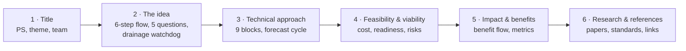

| Slide | Time | Key line | Point at |
|---|---|---|---|
| 1 · Title | 15 s | "Drishti tells a city where water will stand on its streets, up to three hours before it does." | PS ID and title |
| 2 · Idea | 60 s | "Observe, check, forecast twenty futures, run physics, run the AI copy, decide — every five minutes." | The six cards left → right, then the five-question ladder |
| 3 · Technical | 90 s | "Physics where it matters, AI where it's fast." | Block 4 (the cycle) top to bottom, then the *Why hybrid?* box |
| 4 · Feasibility | 45 s | "It runs today — 19 seconds, on a laptop, with open data." | Readiness bars, the rainfall chart, the challenge table |
| 5 · Impact | 45 s | "Warnings before the water, routes for the ambulance, the right pipe fixed first." | The benefit flow row |
| 6 · References | 15 s | "Every method traces to published work; the links open the live system." | The app thumbnails |

**Slide 3 in detail** — walk the centre column:

1. *Rain observations* → *Quality check* ("a faulty reading is rejected, and logged").
2. *Radar usable?* → if not, "gauges only, and we say DEGRADED".
3. *Ensemble nowcast* → "20 possible rain futures".
4. *Twin state at t0* → *AI surrogate depths* → "0.2 seconds for all 20".
5. *Hotspot risk?* → "full physics refine only where it matters".
6. *Probabilistic forecast* → *Crosses 10 cm?* → early warning.
7. *Impact · routes · alert* → audit ledger.

---

## 6. Technical deep dive

### 6.1 One physics time step

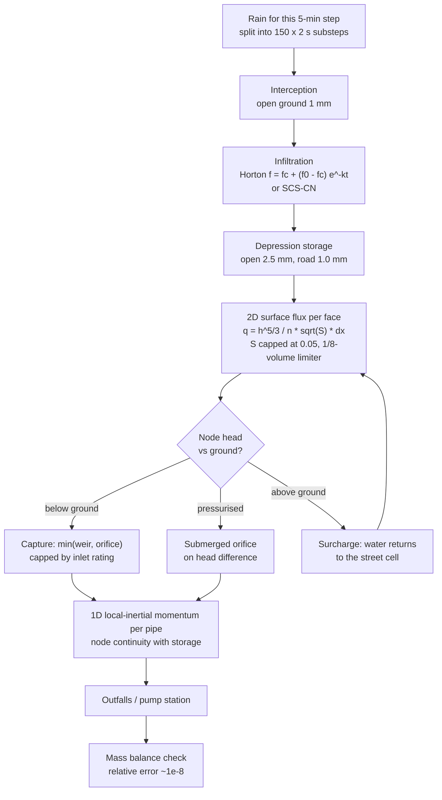

**Key equations**

| Process | Equation | Parameters |
|---|---|---|
| Surface flux (Manning, wide channel) | `q = h_flow^(5/3) / n · √S · dx` | `S = min(|Δws|/dx, 0.05)`, dt = 2 s |
| Stability limiter | `q_face ≤ 0.125 · h_upwind · dx² / dt` | conservative, explicit |
| Horton infiltration | `f(t) = fc + (f0 − fc) · e^(−k t)` | road 5/1 mm/h, open 35/8 mm/h |
| SCS-CN | `Q = (P − Ia)² / (P − Ia + S)`, `S = 25400/CN − 254` mm | chosen in `config/hydraulics.yaml` |
| Pipe full capacity | `Qcap = (1/n) · (πD²/4) · (D/4)^(2/3) · √S` | n = 0.013 concrete |
| Inlet exchange | weir `Cw · P · h^1.5`, orifice `Co · Ao · √(2 g h)` | min of the two, capped |
| Mass balance | `rain + inflow = infiltration + outflow + surface + depression + interception + node storage` | reported per run |

### 6.2 Rain nowcast (STEPS)

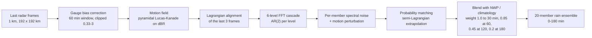

pysteps has no Python 3.14 wheel, so the algorithm is re-implemented in NumPy following pysteps.
Member 0 is the unperturbed control.

### 6.3 AI surrogate: data → model → deployment

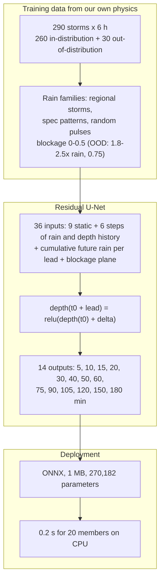

Splits are **by scenario, never by window**, so the test set contains storms the model has never seen.

### 6.4 Adaptive fidelity (hotspot refinement)

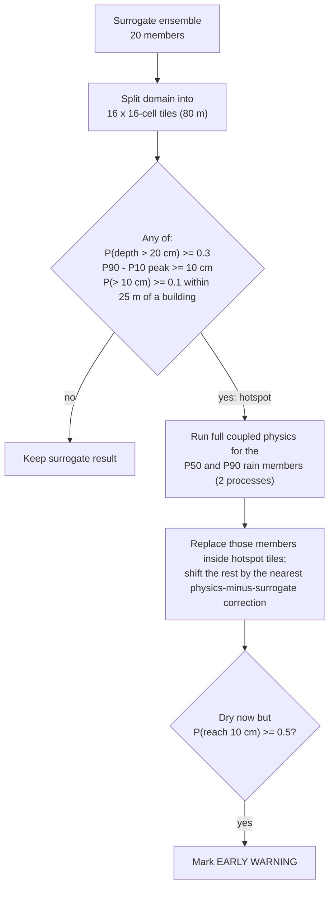

### 6.5 Forecast cycle as a sequence

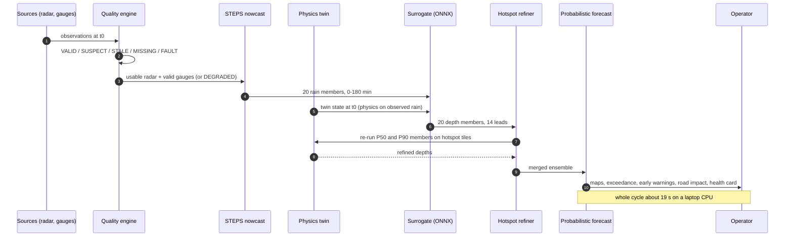

### 6.6 Degraded modes

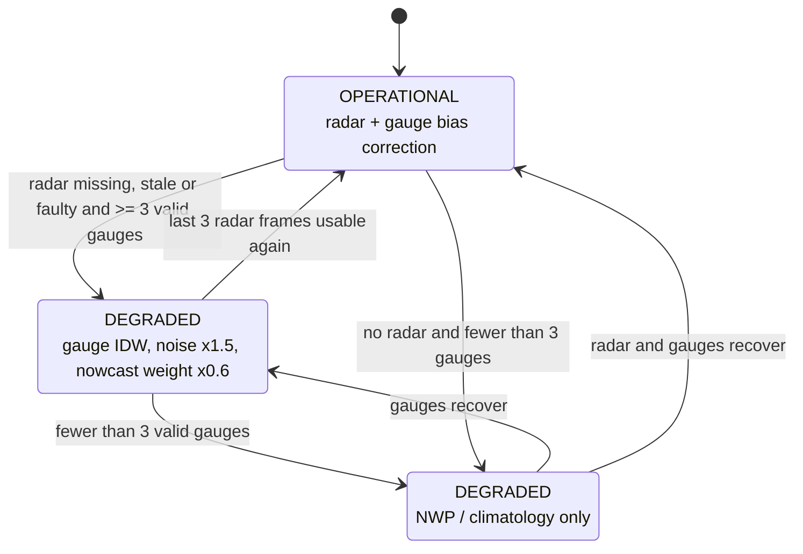

Every cause is listed in `health.reasons` (e.g. `radar MISSING`, `G3 = FAULT (frozen)`).

### 6.7 Closed loop: assimilation and diagnosis

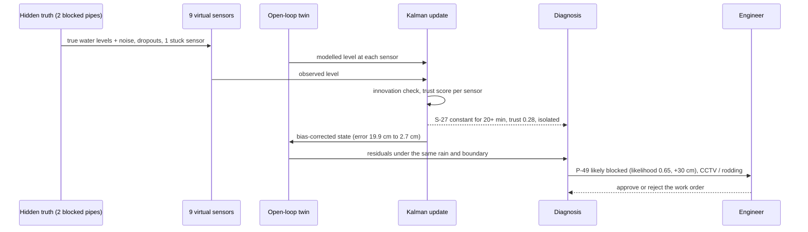

### 6.8 Routing

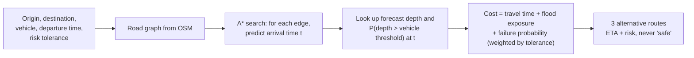

| Vehicle | Degraded above | Impassable above |
|---|---|---|
| Two-wheeler | 7 cm | 15 cm |
| Car | 10 cm | 30 cm |
| Ambulance | 15 cm | 35 cm |
| Bus | 25 cm | 45 cm |
| Fire truck | 35 cm | 60 cm |

The **emergency policy** toggle lets emergency vehicles use 5–10 cm deeper water and restricts public
traffic earlier.

### 6.9 Roles and access

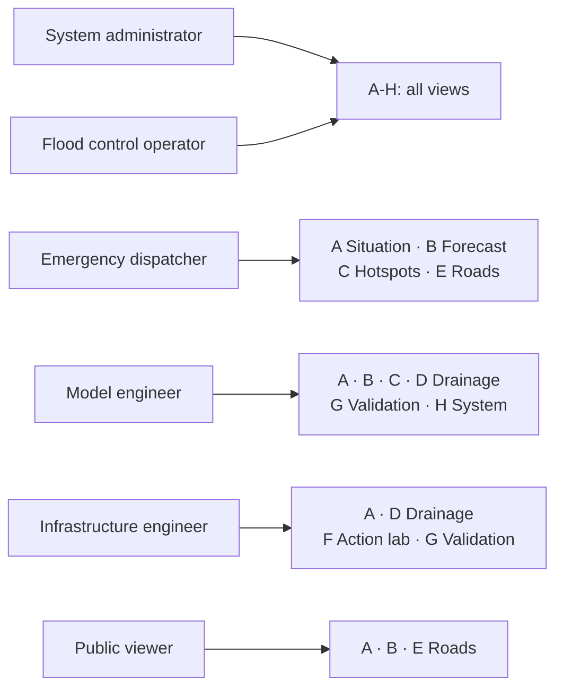

### 6.10 Provenance: every run is replayable

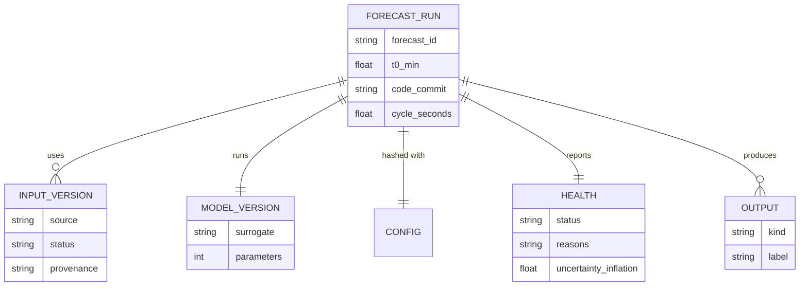

`label` is always one of *observed / derived / modelled / synthetic*, and the dashboard shows it as a
tag on every panel.

### 6.11 Deployment

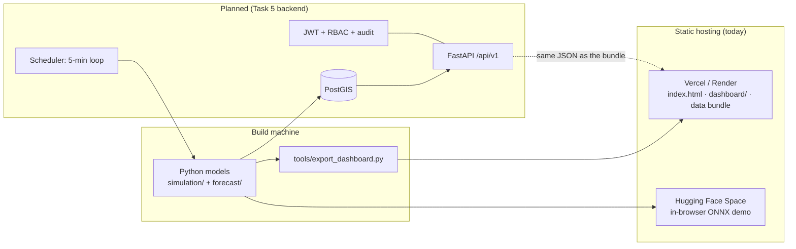

---

## 7. Q&A bank

| Likely question | Answer |
|---|---|
| **Are these real drains?** | No. KIET has no surveyed drain map, so the network is generated from terrain and roads and every asset is tagged `verified=false`. A surveyed network drops in with the same JSON schema — no code change. |
| **Can a 30 m DEM drive a 5 m model?** | It gives the broad fall of the land, not kerb-level detail — and the UI says so (data tier 1). A LiDAR or drone DEM replaces it directly. |
| **How do you know the model is right without flood data?** | Three ways: the physics conserves mass to ~1e-8 and passes 31 tests; twin experiments score the forecast against a hidden simulated truth; and the replay/validation view is ready for observed events. We do not claim real-world skill yet. |
| **Why not just train an AI on rainfall?** | Our rainfall-threshold baseline scores CSI 0.11. Flooding depends on terrain and drains; an AI trained on our own physics learns that coupling, and hotspots are re-checked with the physics. |
| **Why is the AI needed if you have physics?** | 20 members × ~12 s of physics ≈ 4 minutes; the surrogate does all 20 in 0.2 s, so the cycle fits in 19 s. |
| **How accurate is the surrogate?** | CSI at 10 cm of 0.82 at +30 min and 0.79 at +180 min on held-out storms, vs 0.58 and 0.24 for persistence; it holds up on out-of-distribution storms (0.78 at +180). |
| **What happens when the radar fails?** | Gauge-only forecast, uncertainty ×1.5, DEGRADED banner. In our drill, early-warning hits fell from 67% to 26% but false alarms stayed at 0%. |
| **Are the probabilities calibrated?** | Not yet — the ensemble is under-dispersive (P10–P90 covers the truth in 5–50% of active cells). Calibration needs assimilation of real data over many events; it is on the roadmap and stated on screen. |
| **Does it control pumps automatically?** | No. It recommends; a human approves. That is a design rule, not a missing feature. |
| **How does it scale to a city?** | The terrain twin, network and configs are per area; a ward is a config. The heavy work is offline training; the live loop is CPU-only. |
| **What does it cost?** | Indicatively ₹7–12.5 lakh for one ward, mostly sensors and a drain survey. Software and data are open; no GPU or per-forecast cloud bill. |
| **What's not built yet?** | The FastAPI server, database and authentication (the dashboard shows the exact responses each endpoint will return), and a full ensemble Kalman filter in place of the per-sensor update. |
| **Which standards do you follow?** | OASIS CAP 1.2 for alerts, GeoJSON for roads and routes, a SensorThings-style observation schema, EPA SWMM `.inp` export for cross-checking the drains. |

---

## 8. Pre-demo checklist & fallbacks

```mermaid
flowchart TD
    A[30 min before] --> B{Laptop online?}
    B -- "yes" --> C[Open Vercel links as backup tabs]
    B -- "no" --> D["Run python -m http.server 8123<br/>everything is local"]
    C & D --> E{Map tiles load?}
    E -- "yes" --> F[Satellite 3D map]
    E -- "no" --> G["Switch map to Chart mode<br/>(2D/3D and Sat toggles top-left)"]
    F & G --> H{Browser WebGL OK?}
    H -- "yes" --> I[Live demo]
    H -- "no" --> J["Play brag-output/brag.mp4<br/>then use screenshots in this doc"]
```

- [ ] `python -m http.server 8123` running from the repo root
- [ ] Landing page and `dashboard/` open in two tabs; browser zoom 100%
- [ ] Forecast issued = **T+115 min**; Radar outage drill **off**; role = Flood Control Operator
- [ ] Deep links ready: `dashboard/#forecast&lead=6`, `#prob`, `#drain`, `#impact`,
      `#actions&scen=pump_failure&diff=1`, `#live&drill=1`, `#valid`
- [ ] `brag-output/brag.mp4` downloaded locally
- [ ] Deck `ppt/Drishti_SIH26085.pptx` open in presenter view (speaker notes on)

---

## 9. Glossary

| Term | Meaning |
|---|---|
| **Nowcast** | A forecast for the next 0–3 hours, built mostly from current observations |
| **Ensemble / member** | One of 20 equally plausible rain futures; their spread is the uncertainty |
| **P10 / P50 / P90** | Depth that 10 / 50 / 90% of members stay below |
| **CSI** | Critical Success Index: hits ÷ (hits + misses + false alarms); 1 is perfect |
| **Persistence** | The baseline "whatever is flooded now stays flooded" |
| **Surrogate** | A neural network trained to imitate the physics model, much faster |
| **Surcharge** | A drain so full that water is pushed back up onto the street |
| **Backwater** | Water in the receiving nala or river stopping the drains from emptying |
| **Assimilation** | Correcting the model's state with live sensor readings |
| **Open loop** | The model running without any sensor correction |
| **STEPS** | Short-Term Ensemble Prediction System — the rain nowcasting method |
| **DEM / DSM** | Digital elevation / surface model (a DSM includes buildings and trees) |
| **CAP 1.2** | Common Alerting Protocol — the standard format for public warnings |
| **Level-1 data** | Demonstration tier: public rain and terrain, synthetic drains and sensors |
